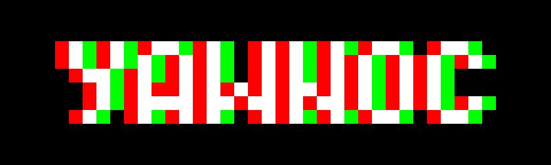

</img>

Yawnoc (which is Conway backwards) is an experimental puzzle game. The player's objective is to collect all green cells in the board
using the resources he is provided with at the beginning of each level. White cells behave just as the classic Game of Life, while
red cells are static and never destroyed.

Cells are implemented in a generic way as to enable the game to have its behavior expanded as I have more ideas for levels. Each level
is a texture where each color is coded to a specific cell. Colors are then mapped to cell types and spawned at the beginning of the level.

